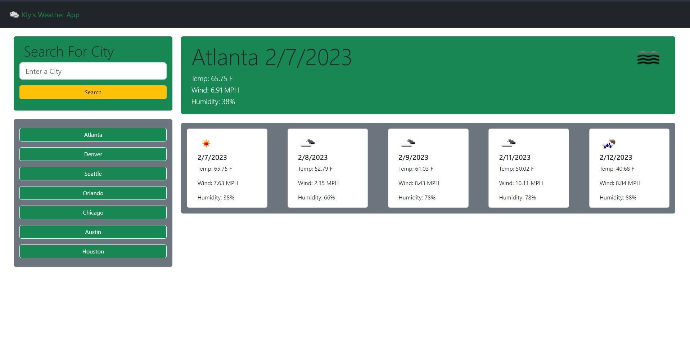

# **Kly's Weather App**

  ## Table of Contents: 
  #### [Description](#description)
  #### [ScreenShot](#screenshot)
  #### [Installation](#installation)
  #### [Usage](#usage)
  #### [License](#license)
  #### [Links](#links)

  ## Description
  ####  Open Weather Map App using buttons and text input and two api calls

  ## ScreenShot
  #### 
  
  ## Installation
  ### Visit my page: https://klydesign.github.io/Module6-WeatherApp/

  ## Usage
  #### Enter search term and click button or click a city from the list

  ## License
  #### The MIT License   
  #### https://www.mit.edu/~amini/LICENSE.md
  

  ## Links
  #### Github Profile: https://github.com/KlyDesign
  #### Deployed App: https://klydesign.github.io/Module6-WeatherApp/
  